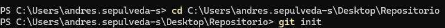
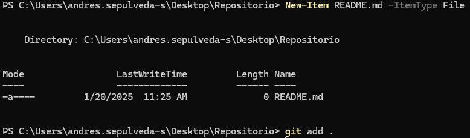
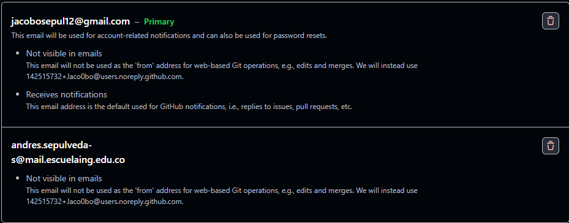

# PARTE I (Trabajo Individual).

1. Crea un repositorio localmente.

2. Agrega un archivo de ejemplo al repositorio, el README.md puede ser una gran opción.

3. Averigua para qué sirve y como se usan estos comandos git add y git commit -m “mensaje”
- El comando git add sirve para agregar cambiosnuevos o modificaciones al area de preparacion antes de confirmarlos.
Un ejemplo basico es git add archivo.txt de esta manera agregariamos el txt, si usamos git add . agregamos todo lo que este.
- el comando git commit -m "mensaje" se encarga de guardar los cambios que se agreguen con git add, cada confirmacion genera 
un identificador unico y almacena un mensaje descriptive del cambio. Un ejemplo basico es git commit -m "agregar funcionalidad"
lo que registra un punto de control en el historial del repositorio junto a un mensaje que lo explica

4. Abre una cuenta de github, si ya la tienes, enlazala con el correo institucional.

5. Crea un repositorio en blanco (vacío) en GitHub.

6. Configura el repositorio local con el repositorio remoto.

7. Sube los cambios, teniendo en cuenta lo que averiguaste en el punto 3 Utiliza los siguientes comandos en el directorio donde tienes tu proyecto:

8. Configura el correo en git local de manera correcta

9. Vuelve a subir los cambios y observa que todo esté bien en el repositorio remoto (en GitHub).