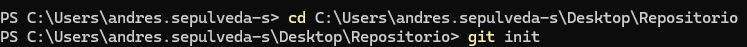

PARTE I (Trabajo Individual).

1. Crea un repositorio localmente.

2. Agrega un archivo de ejemplo al repositorio, el README.md puede ser una gran opción.

3. Averigua para qué sirve y como se usan estos comandos git add y git commit -m “mensaje”

4. Abre una cuenta de github, si ya la tienes, enlazala con el correo institucional.
